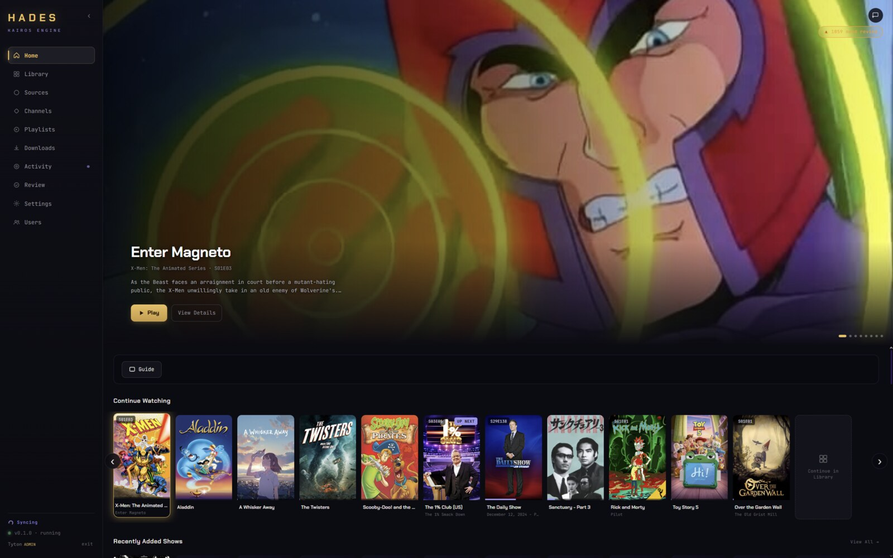
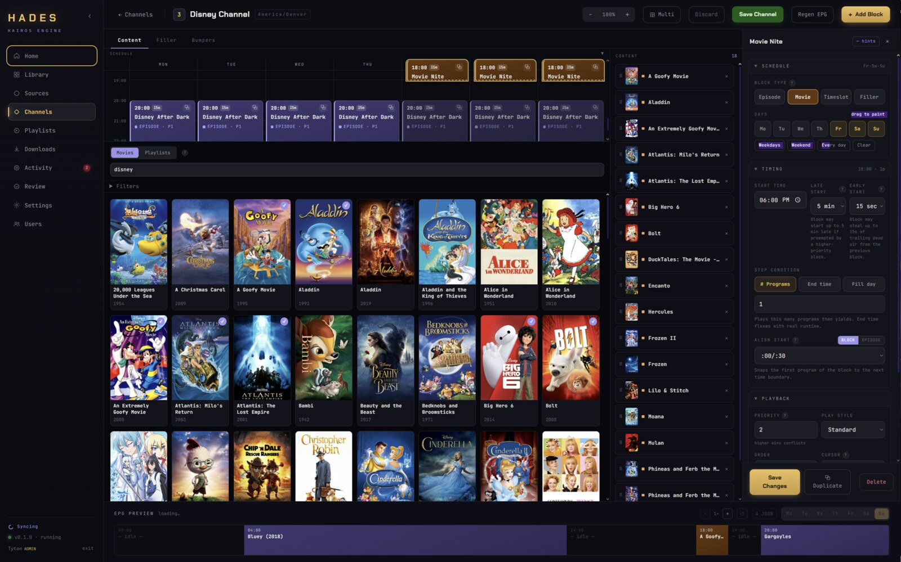
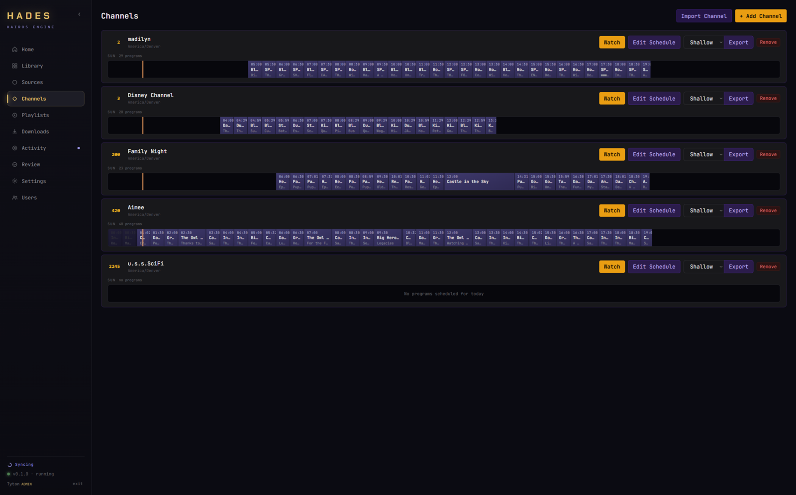
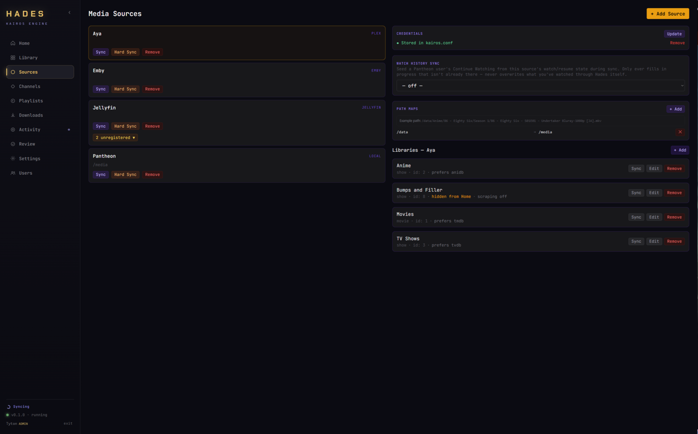
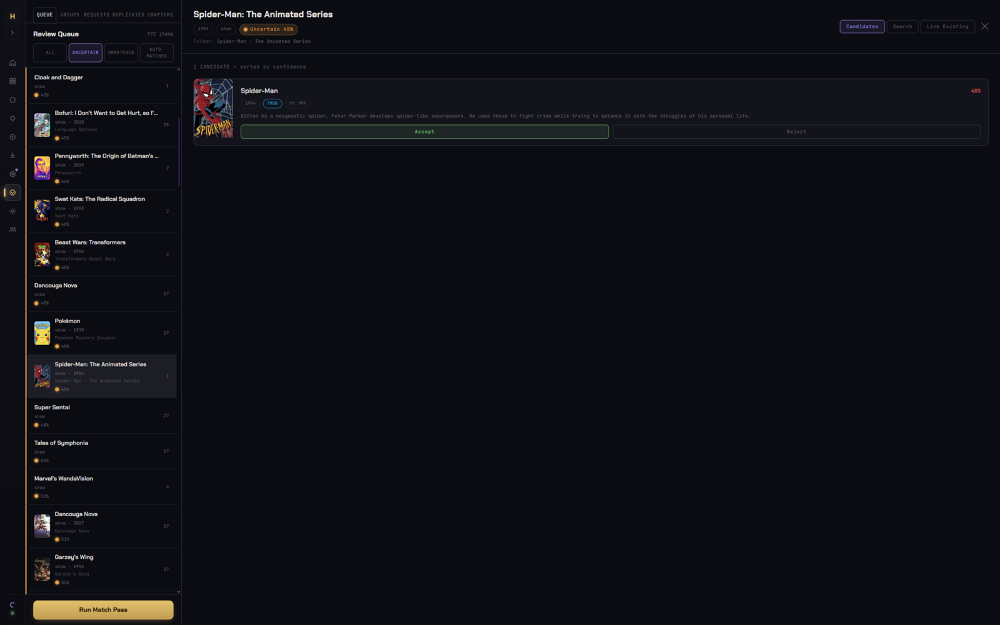
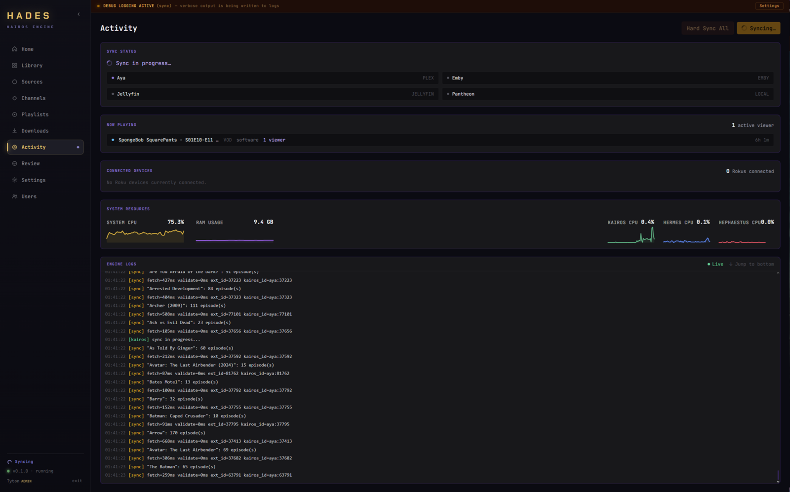

# Pantheon

A media platform built around three pillars:

- **Media library management** — sync from Plex, Jellyfin, Emby, or local filesystem; scrape metadata from TMDB/TVDB/AniDB; manage collections, fix incorrect matches, enrich metadata, and write back to original libraries.
- **IPTV scheduling** — build 24/7 channels with block schedules, rerun rules, filler, bumpers, dedicated premiere timeslots, and live EPG. Connect any IPTV client.
- **Media player** — direct playback within Hades and native client applications.

## Screenshots

<table>
<tr>
<td width="50%"><a href="docs/screens/HomePage.jpg"></a><br/><sub><b>Home</b> — hero carousel, Continue Watching, and library shelves.</sub></td>
<td width="50%"><a href="docs/screens/BlockBuilder.jpg"></a><br/><sub><b>Channel builder</b> — paint a weekly schedule, live EPG preview included.</sub></td>
</tr>
<tr>
<td width="50%"><a href="docs/screens/Channels01.png"></a><br/><sub><b>Channels</b> — every channel's day at a glance.</sub></td>
<td width="50%"><a href="docs/screens/Sources01.png"></a><br/><sub><b>Media sources</b> — Plex, Jellyfin, Emby, and local, side by side.</sub></td>
</tr>
<tr>
<td width="50%"><a href="docs/screens/Review01.png"></a><br/><sub><b>Metadata review</b> — accept or reject uncertain scraper matches.</sub></td>
<td width="50%"><a href="docs/screens/Activity.png"></a><br/><sub><b>Live activity</b> — sync status, now playing, system resources.</sub></td>
</tr>
</table>

More in the full gallery — chapter review, per-account sync, multi-user & parental controls: **[x64tyko.github.io/Pantheon/Screenshots.html](https://x64tyko.github.io/Pantheon/Screenshots.html)**

## Alpha Release Notice

Pantheon is currently in **Alpha**. This is a source-available engineering artifact. We do not accept unsolicited pull requests. If you encounter an issue, please read our [Contributing Guidelines](CONTRIBUTING.md), check the [Roadmap](docs/ROADMAP.md), and use the [Issue Template](.github/ISSUE_TEMPLATE/bug_report.yml).

---

## Status & Coverage

[](https://github.com/X64Tyko/Pantheon/actions/workflows/docker-kairos.yml)
[](https://github.com/X64Tyko/Pantheon/actions/workflows/docker-hephaestus.yml)
[](https://github.com/X64Tyko/Pantheon/actions/workflows/docker-hermes.yml)

| Component | Status | Test Suite | Tests | Coverage (Target) |
|---|---|---|---|---|
| **Kairos** | Alpha | `momus_kairos` | 429 | ~85% (Core / Scheduler) |
| **Hades** | Alpha | `vitest` | 135 | ~40% (API / Stores) |
| **Hermes** | Alpha | `momus_hermes` | 19 | ~45% (Gateway — security surface covered via Kairos) |
| **Hephaestus** | Alpha | `momus_hephaestus` | 26 | ~35% (Transcoder — Kairos-facing routes covered via Kairos) |

*Pantheon currently runs **609 automated tests** across the stack using the **Momus** framework and **Vitest**.*

Kairos's suite includes endpoint-level security regression tests (`momus/kairos/api/test_content_service_security.cpp`) that spin up a real `Router` against a throwaway database and fire actual attack payloads at the running server — e.g. confirming an admin can't forge the locally-cached-poster path sentinel into an arbitrary local file read via `PATCH /api/shows/:id` or the public `/api/images/proxy` endpoint, and that no secret content ever appears in a response when the attack is (correctly) rejected.

The profile-switch PIN system (Netflix/Plex-style "Who's watching?" picker layered on top of the existing username/password login) is covered at two levels: `auth/test_auth_store.cpp` exercises `AuthStore::switchProfile` directly (PIN set/clear, correct/incorrect/absent PIN, the admin-profiles-always-require-a-PIN rule, and the 5-attempt lockout with its recovery window), while `api/test_auth_service_routes.cpp` spins up a real `Router` the same way the security regression tests do and drives the actual HTTP endpoints (`GET /api/auth/profiles`, `POST /api/auth/switch/:id`, `PATCH /api/users/:id/pin`) to confirm the routing/auth-gating layer wires that logic up correctly — e.g. that the profile picker is visible to any authenticated viewer (not admin-gated like `/api/users`), while setting a PIN is admin-only, and that switching profiles is denied without the right PIN.

Kairos's endpoint tests also cover most of Hermes's and Hephaestus's own security surface: neither proxies to Kairos with any logic of its own, so Kairos's route-level suites (including the two above, plus `api/test_restriction_access_check.cpp` and `api/test_playback_and_channel_routes.cpp` for the `access-check`, `/api/auth/me`, `/api/channels`, and `/api/playback/:content_type/:id` endpoints those services depend on) validate what a client sees through either of them too.

Scheduler determinism — the property the [Memory-First EPG Projection](docs/ARCHITECTURE.md) model depends on — is covered by `scheduler/test_natural_advance.cpp` (episode-order advancement against a library that changes shape mid-run: out-of-order backfills, multiple simultaneous gaps, season boundaries) and `scheduler/test_determinism_regression.cpp`, which runs the exact scenario that would otherwise let live schedule activity leak into a projection: generate a preview, commit an unrelated short-horizon schedule update in between (simulating ordinary background polling), then generate the same preview again and assert every item is still identical — across both UTC and non-UTC channel timezones.

---

## Quick start

No source build required — this pulls prebuilt images from GitHub Container Registry.

**1. Get the compose file**

```bash
mkdir pantheon && cd pantheon
curl -O https://raw.githubusercontent.com/X64Tyko/Pantheon/master/docker-compose.yml
```

(Or point Unraid's Compose Manager at that same URL.)

**2. Set your paths**

Open `docker-compose.yml` and update the volume lines under `kairos` to point at your own directories:

```yaml
volumes:
  - /mnt/user/appdata/kairos:/data          # config + database
  - /mnt/user/Media:/media:ro               # your media root (read-only)
  - /mnt/user/Media/Filler:/downloads       # yt-dlp download destination
```

These are Unraid-style example paths — any absolute host path works (e.g. `/home/you/media`).

**3. Pick your transcoding hardware** *(optional)*

The `hephaestus` service transcodes on CPU by default. If you have a GPU, uncomment the matching block in its `environment`/`devices`/`runtime` lines:

| Hardware | What to uncomment |
|---|---|
| NVIDIA | the three `NVIDIA_*`/`HEPH_HW_ACCEL=nvidia` lines, and `runtime: nvidia` (requires the [NVIDIA Container Toolkit](https://github.com/NVIDIA/nvidia-container-toolkit) on the host) |
| AMD / Intel (VAAPI) | `HEPH_HW_ACCEL=amd` and the `devices` block (adjust `/dev/dri/renderD128` if your render node differs) |
| None | leave everything commented out — CPU transcoding just works |

**4. Start the stack**

```bash
docker compose up -d
```

**5. Check it's up**

```bash
docker compose ps
```

All services should show `Up` — except `cloudflared`, which exits cleanly (`Exited (0)`) unless you've set up the optional [Cloudflare Tunnel](#remote-access-optional) token. That's expected, not a failure.

Open **http://your-server:8000** — that's the Hades management UI, served through Hermes.

Direct Kairos access (API, debugging) is on **:8081**.

---

## Remote access *(optional)*

LAN-only `http://your-server:8000` works fine for local use, but some features — notably Chromecast sending from Hades — need a secure (HTTPS) context, which plain HTTP over a LAN address never satisfies.

The compose file ships with an optional `cloudflared` service for exactly this, off by default:

1. In [Cloudflare Zero Trust](https://one.dash.cloudflare.com/) → **Networks → Tunnels → Create a tunnel** → connector type **Docker** → copy the token.
2. In the same wizard, add a **Public Hostname** (e.g. `pantheon.yourdomain.com`) → service type **HTTP** → URL `hermes:8000`.
3. Put the token in a `.env` file next to `docker-compose.yml`:
   ```
   CLOUDFLARE_TUNNEL_TOKEN=eyJ...
   ```
4. `docker compose up -d` (or restart the stack) — the `cloudflared` container picks up the token and connects.

No token set? The `cloudflared` container exits cleanly on its own (`Exited (0)`) instead of crash-looping — nothing else to configure, and nothing is exposed.

---

## First-time setup (5 minutes)

Hades' first admin account gets a guided tour that highlights each step below in the UI as you go. For the full walkthrough (including scraper API keys) see [`docs/First-Time Setup.html`](docs/First-Time%20Setup.html).

### 1. Add a media source

Go to **Sources → Add Source**. Pantheon supports:

| Source type | Auth |
|---|---|
| **Plex** | Server URL + token (from Account → Troubleshooting → XML) |
| **Jellyfin** | Server URL + API key + user ID |
| **Emby** | Server URL + API key + user ID |
| **Local** | Mount path (no auth needed) |

Enter the connection details and test the connection.

### 2. Add libraries and sync

After saving the source, go back into it and add the libraries you want Kairos to know about (TV Shows, Movies). Hit **Sync** — Kairos fetches all episode metadata and file paths. 

> **Important:** If you have the same media on multiple sources (e.g., Plex and a local mount), make sure to configure **Path Maps** (Step 3) *before* syncing. This allows Pantheon to deduplicate items and register them as the same piece of media rather than creating duplicates.

Large libraries take a few minutes; progress is visible in the **Activity** log.

### 3. Set the path map

Your media server reports file paths from its own perspective (e.g. `/data/TV/...`). If your media is mounted at a different path inside the Kairos container (e.g. `/media`), add a path map under **Sources → your source → Path Maps**:

```
/data  →  /media
```

This tells the transcoder where to actually find the files.

### 4. Create a channel

**Channels → New Channel**. Give it a name, number, and timezone. Leave the seed alone — it makes shuffles reproducible (same week = same lineup).

### 5. Add a block

Open the channel, click **Add Block**. Choose days, a start time, and a block type. Add a show or movie list to it. Save.

### 6. Preview the EPG

Click **Preview** on the channel page. You'll see the resolved grid — what plays when, with filler filling the gaps. Adjust priority and timing until it looks right, then **Save Channel**.

---

## Connecting IPTV clients

Hermes exposes standard M3U and XMLTV endpoints:

| Endpoint | URL |
|---|---|
| M3U playlist | `http://your-server:8000/playlist.m3u` |
| XMLTV guide | `http://your-server:8000/epg.xml` |
| HDHomeRun | auto-discovered on the LAN |

### XTeve → Plex

If you're routing through XTeve into Plex DVR:

1. Add the M3U and XMLTV URLs to XTeve
2. Map channels in XTeve
3. In Plex: **Settings → Live TV & DVR → Add Device** → point at XTeve
4. After any schedule change: refresh XTeve's XMLTV cache, then refresh Plex's guide

### Direct IPTV clients

TiViMate, Channels DVR, and most IPTV apps can consume the M3U and XMLTV endpoints directly.

---

## Scheduling model

Channels are built from **blocks** — recurring time slots on chosen days, each with a content list and an advancement rule.

| Concept | What it does |
|---|---|
| **Block** | Owns a time window on specific days. Higher priority wins when blocks overlap. |
| **Advancement** | How the block walks its list: `sequential`, `shuffle`, `smart_shuffle`, `rerun_shuffle`, `rerun_smart` |
| **Cursor** | Bookmark inside a show — global (shared everywhere), channel (shared on this channel), or block (private). |
| **Timeslot block** | Allows fixed-time programming slots (e.g. "Toonami") with multiple rotating shows and premiere dates. |
| **Filler** | Patches gaps between programs so the channel never goes dark. Duration-aware: fits clips to the seam. |
| **Bumpers** | Intro/outro branding clips at block boundaries, plus interstitials every N programs. |

For a full visual breakdown of how all these interact, see the scheduling diagram in `/docs`.

---

## Discovery & Downloads

Kairos includes yt-dlp integration and *arr stack support:

- **Discovery:** Search TMDB, TVDB, or AniDB directly from Hades and request new content. Requests can be approved to automatically push the media to your Sonarr or Radarr stack.
- **yt-dlp:** Paste a URL (YouTube playlist, video, etc.) in the Downloads page to pull bumpers and filler directly to your local media folders.

---

## Environment variables

### Kairos

| Variable | Default | Description |
|---|---|---|
| `KAIROS_SYNC_THREADS` | `min(8, cpu count)` | Parallel connections when fetching episode metadata. The compose file sets this to `4` explicitly. |
| `KAIROS_DEBUG` | *(unset)* | Set to `1` for verbose sync, ffprobe, and scraper logs. Equivalent to toggling **Sync Debug Logging** in Settings. |
| `KAIROS_DEBUG_EPG` | *(unset)* | Set to `1` for verbose EPG scheduling logs. Equivalent to **EPG Debug Logging** in Settings. |

Both debug flags are also controllable at runtime without restart via **Settings → Diagnostics** in Hades — changes are persisted to the database.

### Hermes

| Variable | Description |
|---|---|
| `KAIROS_URL` | URL Hermes uses to reach Kairos — set automatically in compose (`http://kairos:8080`) |
| `HEPHAESTUS_URL` | URL Hermes uses to reach Hephaestus — set automatically in compose |
| `HADES_URL` | URL of the Hades frontend — set automatically in compose |

---

## Building from source

```bash
# C++ engine (requires cmake, ninja, g++)
cmake -B kairos/build -G Ninja -S .
cmake --build kairos/build

# Hades UI (requires node, pnpm)
cd hades
pnpm install
pnpm dev        # dev server on :5173 (proxies API to kairos on :8080)
pnpm build      # production build
```

Run both together with `./dev.sh` — starts Kairos on `:8080` and the Hades dev server on `:5173`.

---

## Architecture

For a deep-dive into the services, data flow, and technical principles (Manifest Management, Drift Correction, Memory-First Projection), see [docs/ARCHITECTURE.md](docs/ARCHITECTURE.md).

---

## API Reference

Kairos exposes the full admin/management REST API that Hades itself is built on — sources, libraries, channels, blocks, scrapers and matching, discovery/requests, chapters, playback, Roku pairing, and more. It's the same surface you'd use to script Pantheon or build an alternate client.

Full endpoint-by-endpoint reference: **[x64tyko.github.io/Pantheon/API.html](https://x64tyko.github.io/Pantheon/API.html)**

---

## Status

Alpha.

| Area | State   |
|---|---------|
| Library sync (Plex, Jellyfin, Emby, local) | Working |
| Cross-source merge & canonical settings | Working |
| Metadata scraping (TMDB, TVDB, AniDB) | Working <experimental> |
| Metadata writeback (Plex, Jellyfin) | Working <experimental> |
| Discovery & Requests (*arr stack integration) | Working <experimental> |
| Chapter detection & review | Working <experimental> |
| Series continuation (skip intro/credits, up next, auto-advance) | Code-complete, untested against a real library |
| Show specials linking | Working |
| IPTV channel scheduling + EPG | Working |
| Stream delivery (Hermes + Hephaestus) | Working |
| Media player | Working |
| Chromecast (browser) | Working <experimental> |
| Chromecast relay (pantheon-relay) | Working |
| Roku native app (pantheon-roku) | Code-complete, untested on hardware |
| Multi-User & Parental Controls | Working <experimental> |
| HDHomeRun emulation | Working |
| Log Centralization | Working |

Issues and feedback welcome.
