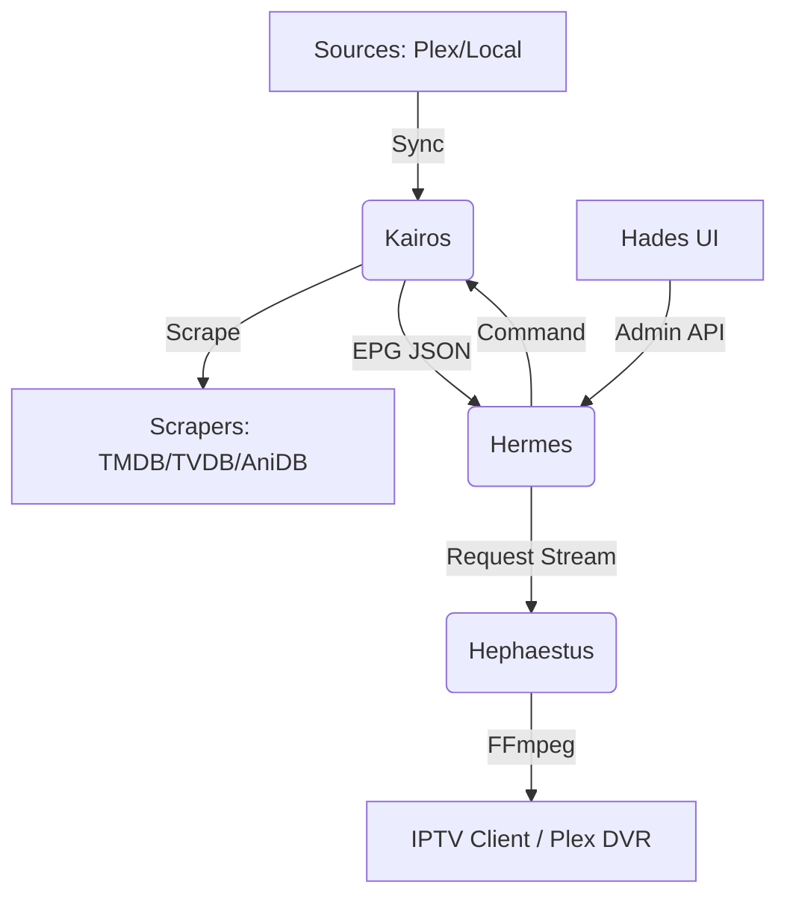

# Pantheon Architecture

Pantheon is a professional-grade media platform designed for high-availability IPTV scheduling and library management. It follows a decoupled, service-oriented architecture to ensure robust performance across diverse hardware environments.

For a high-level overview of our development goals, see the [Project Roadmap](ROADMAP.md).

## Component Overview

Pantheon consists of four primary services, each with a focused responsibility:

### 1. Kairos (Scheduling & Library Engine)
Kairos is the "brain" of the system.
*   **Library Sync:** Communicates with Plex, Jellyfin, Emby, and the local filesystem to index media. **Path mapping** is used during sync to unify media stored under different paths across sources, ensuring different source paths representing the same physical location are registered as a single item.
*   **Metadata Scraping:** Aggregates metadata from TMDB, TVDB, and AniDB using a multi-source priority system.
*   **EPG Materialization:** Resolves complex scheduling rules (sequential, shuffle, smart shuffle, reruns, and timeslots) into a deterministic linear timeline.
*   **Timeslot Blocks:** Implements fixed-time scheduling for blocks matching classic programming blocks (e.g., Toonami, One Saturday Morning), with support for rotating shows, premiere dates, and specific pre-premiere behaviors.
*   **State Management:** Tracks watch progress, channel cursors, and play records without persistent database writes during the projection flow.

### 2. Hades (Management UI)
A React-based web console for administrators.
*   **Dashboard:** Real-time visibility into sync activity and stream health.
*   **Channel Editor:** Visual EPG preview with drag-and-drop block management.
*   **Review Queue:** Manual match verification and metadata priority tuning.

### 3. Hermes (Public Endpoint & Gateway)
The entry point for all external clients.
*   **Gateway:** Reverse proxies Hades and provides unified access to M3U playlists and XMLTV guides.
*   **Emulation:** Implements HDHomeRun discovery protocols for native integration with Plex DVR and other hardware-based tuners.
*   **Authentication:** Manages session tokens and admin access.
*   **Parental Controls:** Enforces rating-based content restrictions and account-level access ceilings across all API and stream requests.
*   **Log Forwarding:** Centralizes logs from client applications (Hades) and internal services.

### 4. Hephaestus (Transcoding Pipeline)
A specialized FFmpeg wrapper for high-concurrency stream delivery.
*   **Dynamic Transcoding:** Just-in-time HLS and MPEG-TS generation with hardware acceleration (NVIDIA/VAAPI).
*   **Drift Correction:** Ensures continuous playback by managing PTS/DTS timestamps across program transitions.
*   **Manifest Management:** Optimized HLS manifest sliding-window for long-running linear channels.

## Technical Principles

### Manifest Management
Pantheon uses a sliding window for HLS manifests. Instead of generating a static file, Hephaestus dynamically updates the manifest as new segments are produced, allowing for infinite linear playback with minimal latency and resource overhead.

### Discovery & Content Requests
The system provides a unified discovery interface that allows users to search for content across external providers (TMDB, TVDB, AniDB). These items can be "requested," which triggers a background process to push the media into the user's *arr stack (Sonarr/Radarr). This integration ensures a seamless workflow from finding new content to it appearing in the local library for scheduling.

### Drift Correction
To ensure that actual wall clock time and transcoding progress match the projected EPG schedule, Hephaestus implements an active drift correction algorithm. This mechanism absorbs hiccups in transcoding—whether the process slows down or finishes early—by comparing a program's local drift to Kairos's authoritative schedule at start time. It then marginally adjusts the transcode speed to maintain proper pacing and alignment with the linear timeline, ensuring continuous playback without accumulation of temporal errors.

### Memory-First EPG Projection
While scheduling data is persisted in SQLite, the actual EPG projection (calculating what plays next week) is performed entirely in memory. This "memory-first" approach avoids database bottlenecks and leverages complex algorithms for sequencing and projection, enabling rapid materialization of months of scheduling data.

## Data Flow

