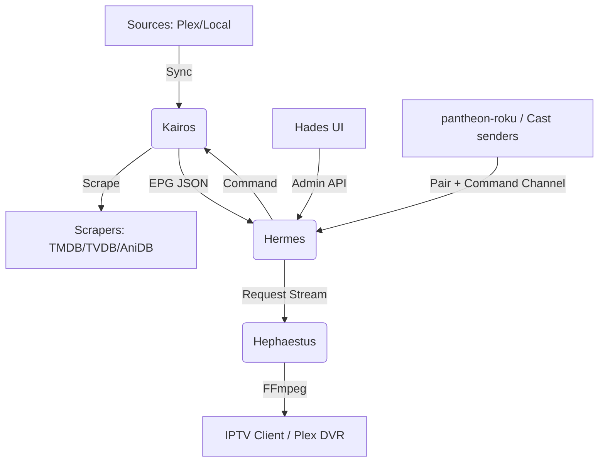

# Pantheon Architecture

Pantheon is a professional-grade media platform designed for high-availability IPTV scheduling and library management. It follows a decoupled, service-oriented architecture to ensure robust performance across diverse hardware environments.

For a high-level overview of our development goals, see the [Project Roadmap](ROADMAP.md). For the full REST API surface exposed by Kairos, see the [API Reference](https://x64tyko.github.io/Pantheon/API.html).

## Component Overview

Pantheon consists of four primary services, each with a focused responsibility, plus a growing set of native client applications (below) that speak to those services over the network.

### 1. Kairos (Scheduling & Library Engine)
Kairos is the "brain" of the system.
*   **Library Sync:** Communicates with Plex, Jellyfin, Emby, and the local filesystem to index media. **Path mapping** is used during sync to unify media stored under different paths across sources, ensuring different source paths representing the same physical location are registered as a single item.
*   **Metadata Scraping:** Aggregates metadata from TMDB, TVDB, AniDB, TVMaze, Trakt, AniList, and Wikidata using a multi-source priority system. TMDB keywords, AniList tags, and Wikidata's "main subject" claim (P921) are pulled into a shared `tags` field on shows/movies (distinct from Plex/Jellyfin's own synced `labels`) — filterable (`tag:`) and usable to build a smart playlist or Home shelf without any manual per-item labeling.
*   **Playlists & Home Shelves:** Named, orderable lists that are either static (an explicit item list) or smart (items periodically recomputed from a stored filter expression — the same query language `/api/shows`/`/api/movies` use). A playlist can be linked to a Plex playlist/collection or a Jellyfin/Emby playlist for two-way sync (pull) and writeback (push, reconciling adds/removes in both directions); a Home page shelf is just a smart playlist with `show_on_home` set, optionally scoped to a `MM-DD` active window (e.g. a `tag:christmas` shelf that only appears in December) — there's no separate shelf-definition table.
*   **Audio/Subtitle Filtering:** Embedded audio/subtitle languages (from the sync-time ffprobe pass) and external subtitle sidecar files (`.srt`/`.ass`/`.ssa`/`.vtt`, matched to their video by filename convention) are both filterable (`audio_language:`, `subtitle_language:`) without a denormalized merge step — the query unions embedded and sidecar data live.
*   **Metadata Writeback:** Pushes confirmed matches back to Plex and Jellyfin — title, genres, cast/crew, ratings, labels, collections, art, and (Jellyfin only) external IDs. Gated strictly on human-confirmed matches. Per-source settings control whether this fires automatically on a match confirm/refresh (off by default) and which fields it's allowed to touch. Plex and Jellyfin use different write mechanisms under the hood (Jellyfin replaces its whole item object; Plex uses an add/remove tag-directive API), which is also why Plex doesn't yet get external-ID or cast writeback — see the Technical Principles below.
*   **EPG Materialization:** Resolves complex scheduling rules (sequential, shuffle, smart shuffle, reruns, and timeslots) into a deterministic linear timeline.
*   **Timeslot Blocks:** Implements fixed-time scheduling for blocks matching classic programming blocks (e.g., Toonami, One Saturday Morning), with support for rotating shows, premiere dates, and specific pre-premiere behaviors.
*   **State Management:** Tracks watch progress, channel cursors, and play records without persistent database writes during the projection flow.

### 2. Hades (Management UI)
A React-based web console for administrators.
*   **Dashboard:** Real-time visibility into sync activity and stream health.
*   **Channel Editor:** Visual EPG preview with drag-and-drop block management.
*   **Review Queue:** Manual match verification and metadata priority tuning.

### 3. Hermes (Public Endpoint & Gateway)
The entry point for all external clients.
*   **Gateway:** Reverse proxies Hades and provides unified access to M3U playlists and XMLTV guides.
*   **Emulation:** Implements HDHomeRun discovery protocols for native integration with Plex DVR and other hardware-based tuners.
*   **Authentication:** Manages session tokens and admin access.
*   **Parental Controls:** Enforces rating-based content restrictions and account-level access ceilings across all API and stream requests.
*   **Log Forwarding:** Centralizes logs from client applications (Hades) and internal services.
*   **Image Proxy:** Fetches and caches external art (Plex/Jellyfin thumbnails, AniDB posters) so browsers can load it without tripping CORS or Private Network Access restrictions.
*   **Device Sessions:** Brokers pairing and command-channel traffic for native clients — currently the Roku channel's long-poll command loop and ECP-based pairing handshake.

### 4. Hephaestus (Transcoding Pipeline)
A specialized FFmpeg wrapper for high-concurrency stream delivery.
*   **Dynamic Transcoding:** Just-in-time HLS and MPEG-TS generation with hardware acceleration (NVIDIA/VAAPI).
*   **Drift Correction:** Ensures continuous playback by managing PTS/DTS timestamps across program transitions.
*   **Manifest Management:** Optimized HLS manifest sliding-window for long-running linear channels.
*   **Client Capability Detection:** Clients can declare their supported video/audio codecs (`POST /stream/client-capabilities`, keyed by bearer token); a VOD session checks the source file's codecs against that declaration (falling back to a fixed h264/aac allowlist if nothing was declared) to decide direct-play vs. transcode per client. External subtitles direct-play as WebVTT muxed into the HLS output where the format allows it; bitmap subtitle formats (PGS/DVD/DVB) instead burn in via an overlay filter and force a transcode.

### 5. Client Applications
Native and semi-native surfaces that consume Hermes/Kairos over the network rather than embedding Hades. Each lives in its own repository outside this monorepo:
*   **[pantheon-roku](https://github.com/X64Tyko/pantheon-roku):** A native BrightScript Roku channel — Connect, Home, Library, Detail, a hand-rolled transposed time-grid Guide, Player (with track menu and Up Next), and device pairing/casting via Hermes's long-poll command channel. Feature-complete and the most battle-tested client: multiple real-hardware debugging rounds (D-pad focus, keyboard component, pagination) plus a pass through Roku's own certification checklist. HDR/codec capability signaling is still hardcoded false.
*   **[pantheon-android](https://github.com/X64Tyko/pantheon-android):** A fully native Kotlin/Jetpack Compose app (no WebView) built against a Kairos-served UI manifest (`GET /api/tv/manifest`) that both this app and Hades' own `/tv` route consume identically. Gradle flavor matrix `store`(google/amazon) × `formFactor`(mobile/tv) → 4 variants; Home/Library/Detail/Guide/Player all built for both form factors, using Media3/ExoPlayer and Paging3. Queries its own real decode capabilities via `MediaCodecList` (`DeviceCodecCapabilities.kt`) and declares them to Hephaestus on session restore/login/profile-switch so per-client direct-play decisions reflect what the device can actually decode, rather than a fixed allowlist. Verified end-to-end on emulator against the live dev stack; the Amazon/Fire TV flavor compiles and assembles in CI but has never run on real Fire OS hardware.
*   **[pantheon-relay](https://github.com/X64Tyko/pantheon-relay):** A minimal HTTPS-hosted Chromecast receiver bootstrap, solving the problem that Cast senders require a secure context Hades' LAN-only HTTP address can't provide on its own (an alternative to the Cloudflare Tunnel path in the README). Its planned role as a connection broker for self-hosted/managed relay modes (see the client apps design in project history) is not yet built — `/api/*` is currently a stub.

## Technical Principles

### Manifest Management
Pantheon uses a sliding window for HLS manifests. Instead of generating a static file, Hephaestus dynamically updates the manifest as new segments are produced, allowing for infinite linear playback with minimal latency and resource overhead.

Separately, `GET /api/tv/manifest` is a different kind of manifest — a UI layout contract (nav structure, filter-pills fields, and a `theme` block of style tokens) shared by native renderers (pantheon-android and Hades' own `/tv` route) so they stay visually in sync with the main Hades design system. The theme tokens are generated from `hades/src/index.css` rather than hand-duplicated, so a design-token change in one place propagates to every manifest-driven client on next fetch.

### Discovery & Content Requests
The system provides a unified discovery interface that allows users to search for content across external providers (TMDB, TVDB, AniDB). These items can be "requested," which triggers a background process to push the media into the user's *arr stack (Sonarr/Radarr). This integration ensures a seamless workflow from finding new content to it appearing in the local library for scheduling.

### Canonical Cross-Source Identity
A single show, movie, or episode can be visible through multiple sources at once (e.g. the same file mounted locally and served by Plex). Rather than tracking settings and metadata separately per source, Pantheon merges matched items into one canonical row: library settings (scraper priority, language, skip-scraping, etc.) are reconciled across every linked source, and a conflict is surfaced to the admin rather than silently resolved. Duplicate items that don't share a path map can also be merged manually from the Review Queue once confirmed as the same title. Metadata writeback to Plex/Jellyfin follows the same rule — it only ever pushes to a source once its match has been explicitly human-confirmed, never on an automatic or best-guess match.

### Metadata Writeback
Jellyfin's write API replaces the whole item object in one POST, so most fields (genres, tags, ratings, cast/crew, external IDs) are a straightforward merge into that object. Plex has no equivalent — its array-valued fields (genre, director, writer, country, collection, label) use an add/remove tag-directive convention with no single "replace" operation, so Pantheon fetches the item's live current tags and diffs against the desired list on every push. This difference is also why Plex doesn't get two fields Jellyfin does: external IDs (Plex's GUID is only changeable via a "match" call that re-scrapes the whole item, not a field edit) and cast (no known-safe write mechanism exists for it on Plex at all). Writeback can run per-item, in bulk across a library/source, or automatically on a scraper match confirm/refresh — the last of these is opt-in per source, off by default.

### Drift Correction
To ensure that actual wall clock time and transcoding progress match the projected EPG schedule, Hephaestus implements an active drift correction algorithm. This mechanism absorbs hiccups in transcoding—whether the process slows down or finishes early—by comparing a program's local drift to Kairos's authoritative schedule at start time. It then marginally adjusts the transcode speed to maintain proper pacing and alignment with the linear timeline, ensuring continuous playback without accumulation of temporal errors.

### Memory-First EPG Projection
While scheduling data is persisted in SQLite, the actual EPG projection (calculating what plays next) is performed entirely in memory and is a pure function of two inputs: a channel's RNG seed and its **anchor** — a snapshot of RNG state and every show/timeslot/filler cursor, captured once per calendar week (in the channel's own timezone). Re-running a projection from the same seed and anchor always produces the same schedule; nothing about a live channel's current play history, or the timing of unrelated background scheduling activity, can influence it. This is what makes a preview stable, lets a channel run in perpetuity from a single seed, and lets the divergence checker cheaply detect "did anything actually change" by comparing two anchor snapshots instead of re-projecting and diffing every item.

## Data Flow

